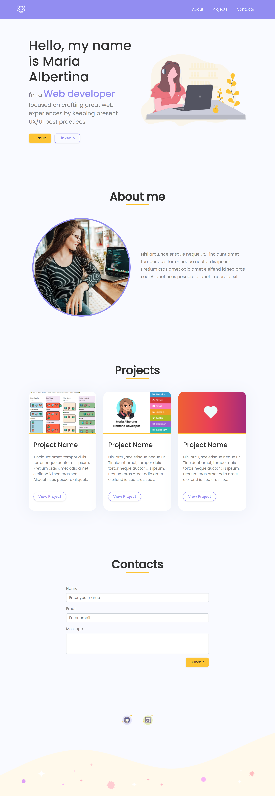

# My First Portfolio - starter project 🦄

this is a basic portfolio HTML starter, missing the styles. It already has assets, that you can change and add your own adjustments  
 

## What's in this project? 🌈

← `README.md`: That's this file, where you can tell people what your cool website does and how you built it.

← `index.html`: This is the main HTML page for your site.

← `style.css`: CSS files add styling rules to your content.

← `script.js`: If you're feeling fancy you can add interactivity to your site with JavaScript.

← `favicon.ico`: A favicon, also known as a shortcut icon, website icon, tab icon, URL icon, or bookmark icon, is a file containing one or more small icons, associated with a particular website or web page

← `assets folder`: Where you can place all of your cool images

 

## How does the final project should look like? 👩‍💻

You are free to change images, colors and text, but the final goal is to have something similar to this:

  

 

## What does this project use? 👀

- [Bootstrap](https://getbootstrap.com/): a popular CSS Framework for developing responsive and mobile-first websites

- [Poppins Google font](https://fonts.google.com/specimen/Poppins)

 

### Other cool links 😎

- [undraw](https://undraw.co/)
- [flaticon](https://www.flaticon.com/)
- [unsplash](https://unsplash.com/)
